# How to Create a Booking Form for Valentine's?

| Table of Contents |
| --- |
| [1. Create the Google Form](#1-create-the-google-form) |
| [2. Link a Google Sheet and Prepare It](#2-link-a-google-sheet-and-prepare-it) |
| [3. Create a Separate Google Sheet for the Members (for Respondent Privacy)](#3-optional-but-recommended-create-a-separate-google-sheet-for-the-members-for-respondent-privacy) |
| [4. Create and Set Up the Apps Script for the Google Sheets](#4-create-and-set-up-the-apps-script-for-the-google-sheets) |

## **1. Create the Google Form**
<input type="checkbox"> 1. Go to [Google Forms](https://docs.google.com/forms/) and search for
 
`Singing Valentines by NU Choir Template`
 
 
<input type="checkbox"> 2. Open it and click `Make a copy`:
 

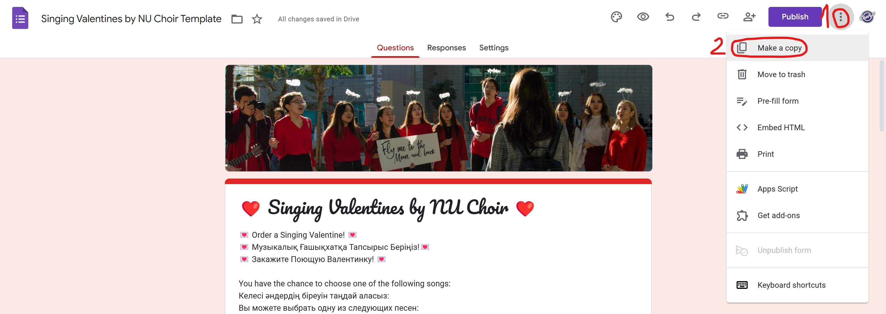
 
 
<input type="checkbox"> In the window that opens after clicking it rename it to "Singing Valentines by NU Choir `current year`" and click `Make a copy`.
 

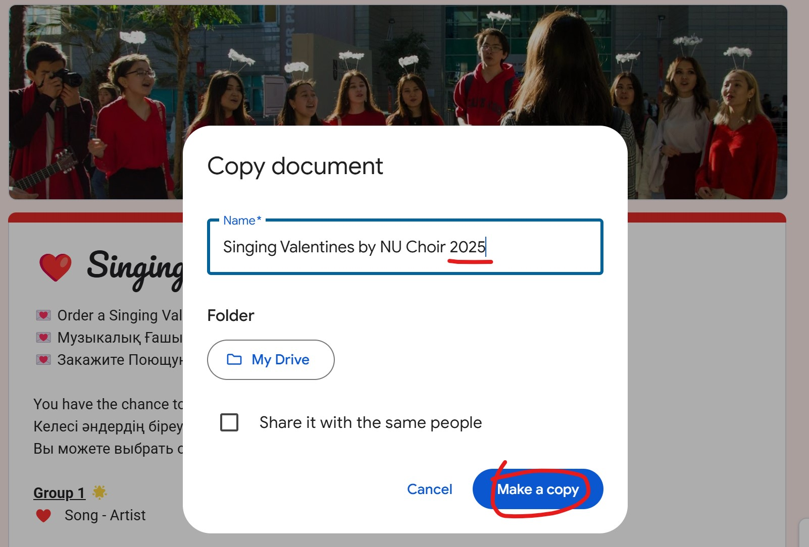
 
 
<input type="checkbox"> 3. In the new form go to the second question that reads `Photo of the recipient` and change it to `File upload`, then click `Continue`.
 

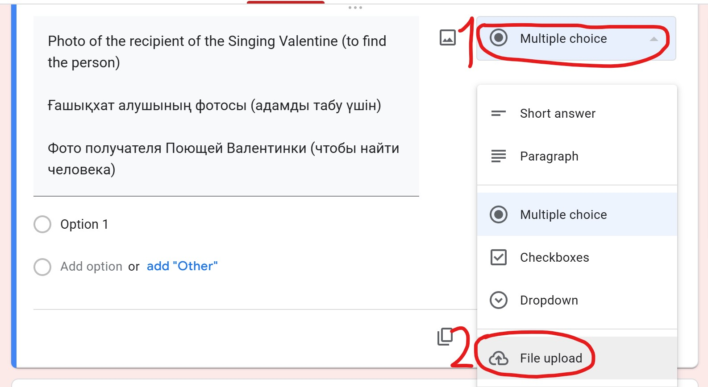
 
 
<input type="checkbox"> 4. Check the `Allow only specific file types` checkmark and choose `Image`.
 

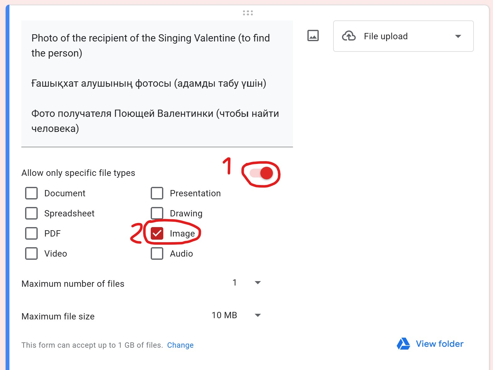
 
 
<input type="checkbox"> 5. Fill the description of the form with the songs on the roster this year and input the deadline to submit the form (doesn't have to be February 12th 23:59, choose whatever works for you), but KEEP the emojis next to the group names (The 🌟 💝 🌸 and 💘. If there are *somehow* more than four groups pick a new emoji that is distinct from these and has a positive vibe to it) so that it is easier for users later in the form!
 

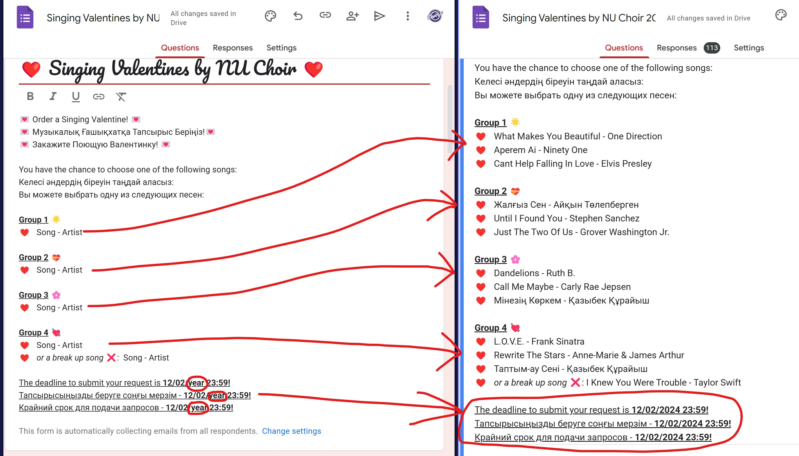
 
 
<input type="checkbox"> Find the song questions that are towards the end of the form and input the songs here as well. If there are less than four groups just copy the `break up song ❌:` text from the last group song question and delete the last group song question itself. If there are *somehow* more than four groups just add another question matching the style of the previous ones and add the `break up song ❌:` to it (so that stylistically that's the last song of the last group xD).
 

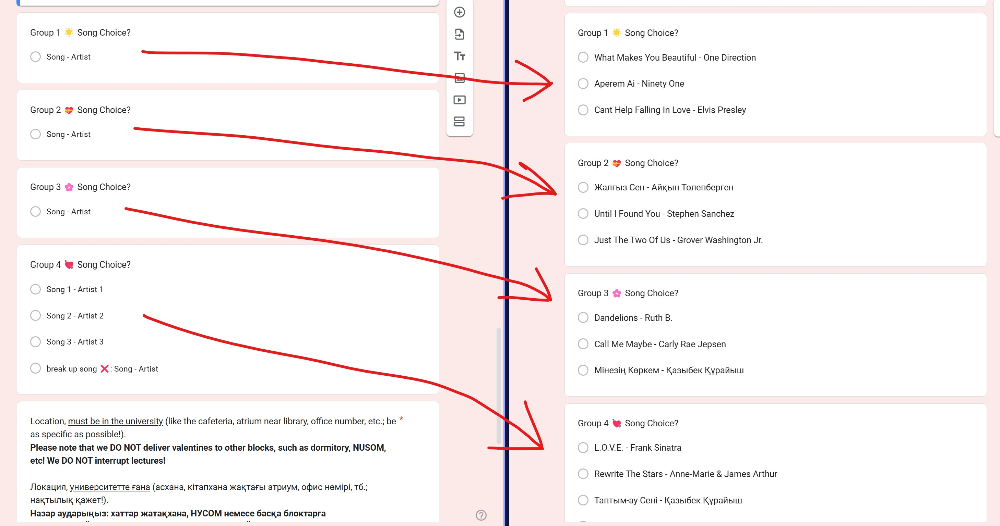
 
 
Don't worry about the `the time and group` question for now. You can change the wording and style of anything on the form. If you want to change the order of the questions, you should **only** do that after linking a Google Sheet to the form!
 
 
<input type="checkbox"> 6. Go to the `Settings`, click on the `Presentation`, click `Edit` on the `Confirmation message`, add the donation info (if you are doing that this year. if not delete the last line on every language) at the very bottom (or after each language, if you want) and save it.
 

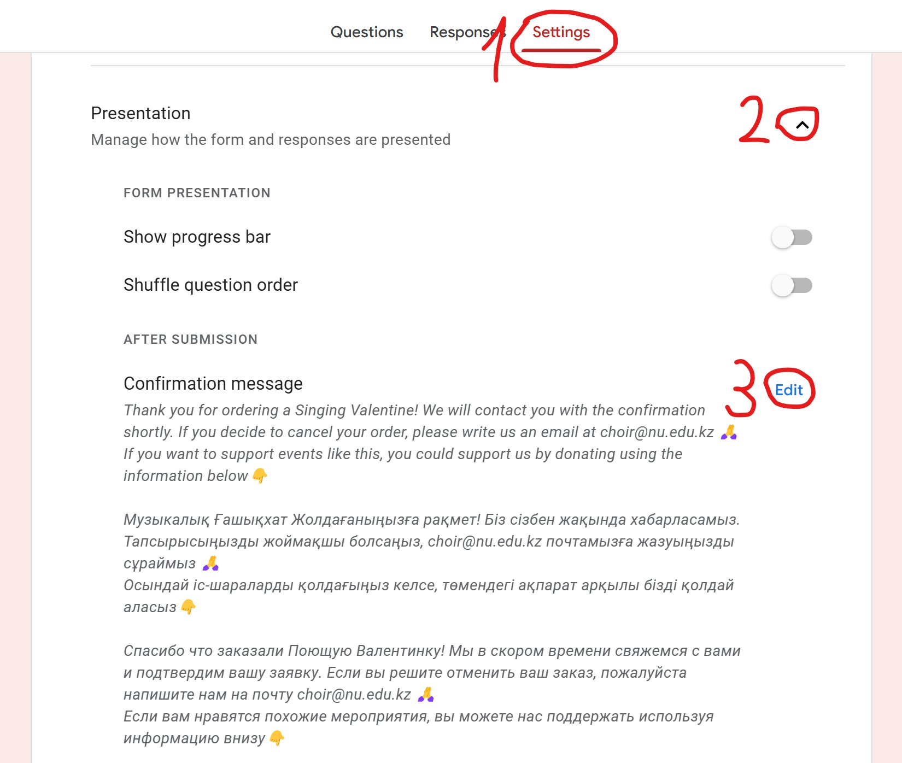
 
 
<input type="checkbox"> 7. Click `Publish`, click `Manage`, click `Nazarbayev University` on the `Editing view`, and click `Restricted`.
 

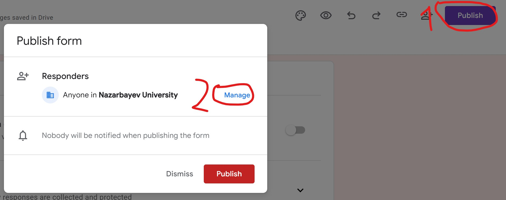

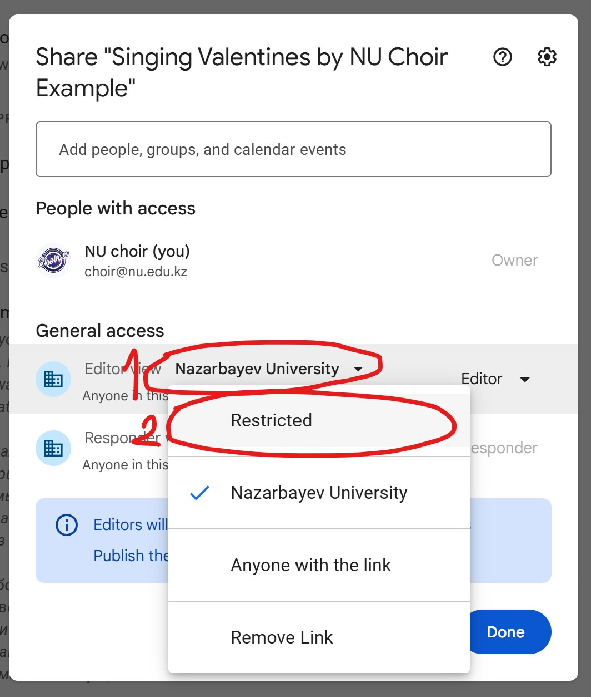
 
 
<input type="checkbox"> Decide whether you want to make it available to everybody, or only people with the Nazarbayev University email (you may change that later too, just in case you want to open it for NU only for the first couple hours, and then to everyone). Then press `Done` and `Publish`.
 

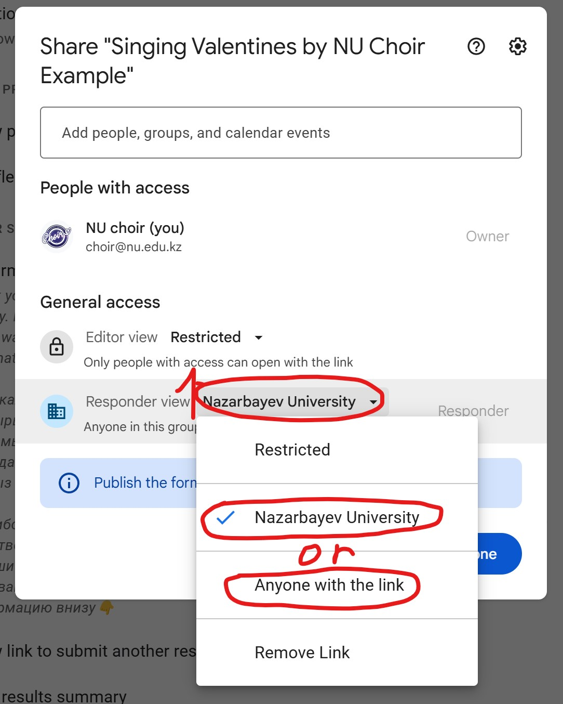
 
 
<input type="checkbox"> 8. Click `Published`, switch the `Accepting responses` switcher, and click `Edit`.
 

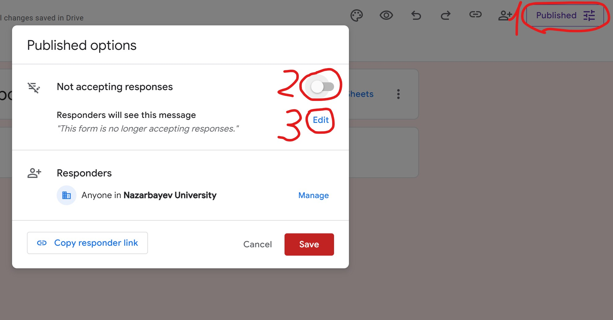
 
 
<input type="checkbox"> Edit the message in the following box (copy and paste in the songs from the form description, edit the time that you plan to open the form, and edit the "time available" in case you are taking lunch breaks as a whole and not in small sub-groups), copy and paste it (to not drag the whole thing, you could just click inside the box, `Ctrl + A`, `Ctrl + C`) to the box in the `Responders will see this message` box, and save it (just in case, copy and paste it to your saved messages in Telegram too, it's kind of a pain to rewrite).
 
<textarea cols="143" rows="33" style="resize:none;">Registration is not open yet. It will start on 10/02/YEAR at 12:00
but you may already start planning your 💌Singing Valentine💌!
Prepare the photo of your recipient (to find the person),
think about the time (from 9:00 until 17:00),
think about the university location (NO other blocks, such as dormitory, NUSOM, etc!),
and choose ONE of the following songs:

Тіркеу әлі басталған жоқ. Тіркеу 10/02/YEAR күні 12:00-де басталады
бірақ сіз 💌Музыкалық Ғашықхатыңызды💌 қазірден бастап жоспарлай аласыз!
Қабылдаушынын фотосын дайындаңыз (адамды табу үшін),
уақытын таңдаңыз (9:00-ден 17:00-ге дейін),
университеттегі локацияны таңдаңыз (жатақхана, НУСОМ немесе басқа блоктарға ЖЕТКІЗІЛМЕЙДІ!),
және келесі әндердің БІРЕУІН таңдаңыз:

Регистрация еще не началась. Она начнётся 10/02/YEAR в 12:00
Но вы можете запланировать вашу 💌Поющую Валентинку💌 прямо сейчас!
Подготовьте фотографию получателя (чтобы найти человека),
выберите время (с 9:00 до 17:00),
выберите локацию в университете (НЕ доставляем валентинки в общежитие, блоки НУСОМ и тд!),
и выберите ОДНУ из следующих песен:

Group 1 🌟
♥️   Song - Artist

Group 2 💝
♥️   Song - Artist

Group 3 🌸
♥️   Song - Artist

Group 4 💘
♥️   Song - Artist
♥️   or a break up song ❌:  Song - Artist</textarea>
 

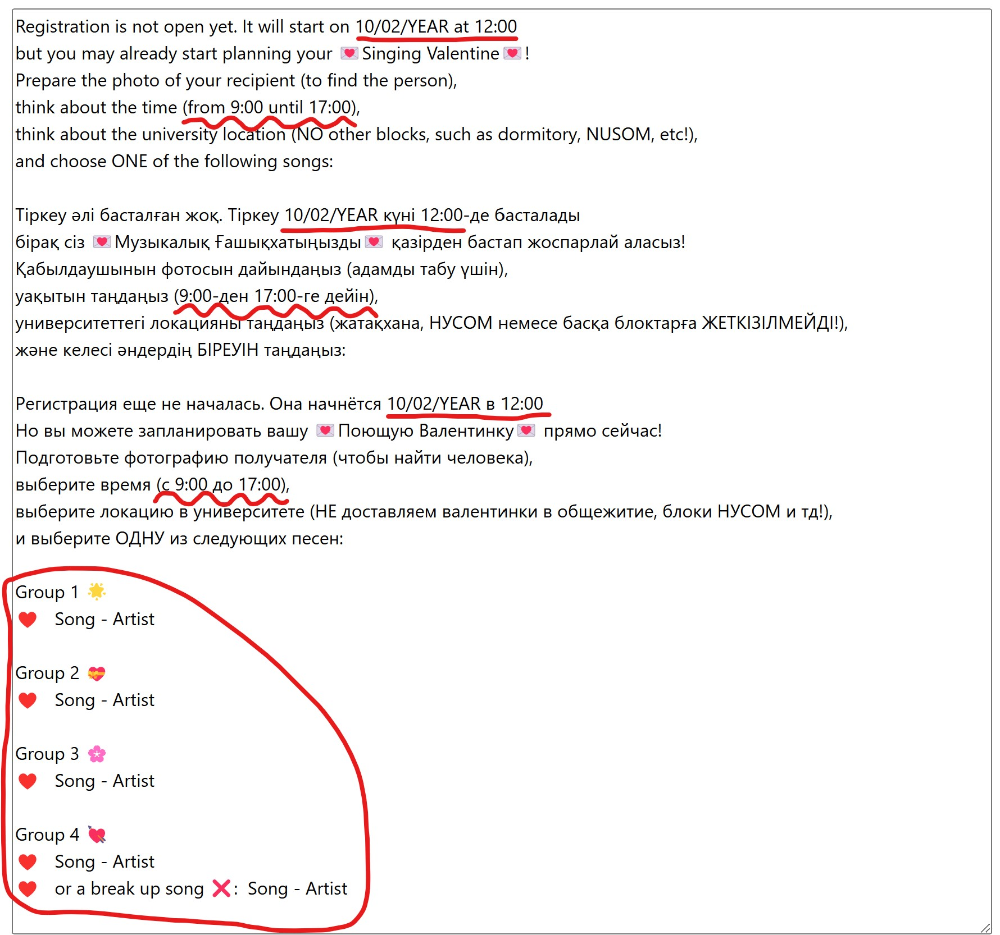

Phew! That's most of what was needed in the form. The rest should be faster xD

## **2. Link a Google Sheet and Prepare It**
<input type="checkbox"> 1. Go to the responses tab, click on `Link to Sheets`, keep the selection of `Create a new spreadsheet`, and click `Create`.
 

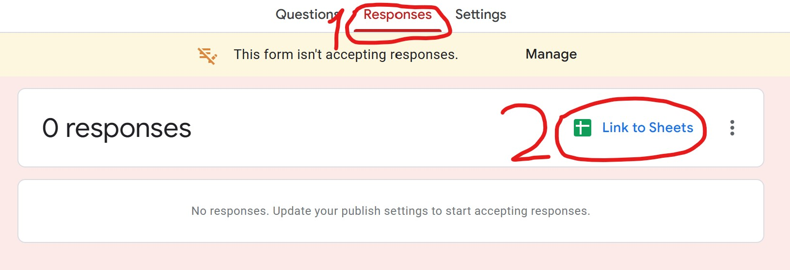

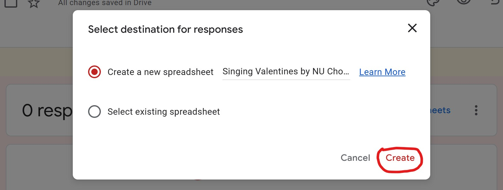
 
 
<input type="checkbox"> 2. Select the last two columns with `Location` and `Contact info` and drag it left of the `Group songs` columns (not required, just for the location to be right next to the time. but keep in mind that if you want to make your own column order here, you have to change the formulas in the later part of this "chapter").
 

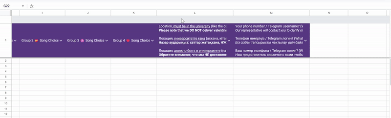
 
 
<input type="checkbox"> 3. Click on the **`+`** to create new sheets for the number of groups you have +1. Name them `Group #` for each group you have and name the last sheet `For code`.
 

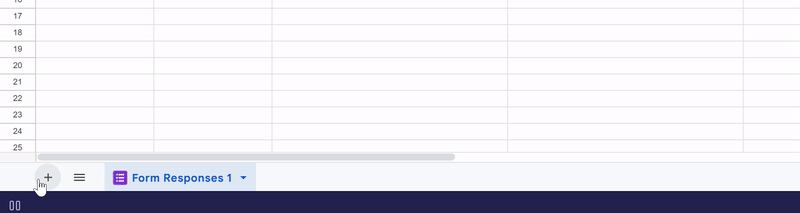
 
 
<input type="checkbox"> 4. Copy everything from the box below (again, to not miss some part of the formula, you could just click inside the box, `Ctrl + A`, `Ctrl + C`) and paste it to the first cell of every of the `Group #` sheets.
 
<textarea cols="143" rows="2" style="resize:none;">Receiver	Photo	Sender	Message	Time	Location	Contacts	Song
=SORT(IFERROR(FILTER(CHOOSECOLS('Form Responses 1'!C$2:M,1,2,3,4,5,6,7,8), REGEXMATCH('Form Responses 1'!$G$2:$G,".*Group 1.*") =TRUE)),6,True)</textarea>
 

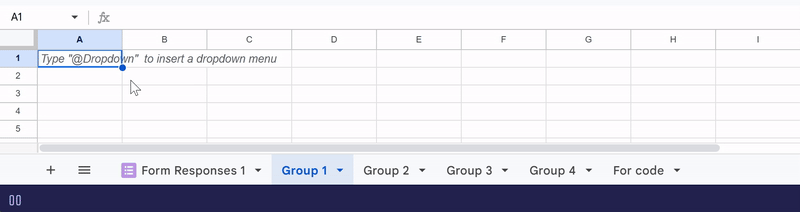
 
 
<input type="checkbox"> Modify the formula in A2 on `Group 2` until the last Group you have (if you *somehow* have more than four groups modify the `M` in `'Form Responses 1'!C$2:M` to whatever the very last column letters are in the `Form Responses 1` sheet):
 
(1) `1,2,3,4,5,6,7,8` -> `1,2,3,4,5,6,7,9`. Change the last number in this list to one more with each sheet. So it is `9` for `Group 2`, `10` for `Group 3`, and etc.
 
(2) `".*Group 1.*"` -> `".*Group 2.*"`. Change the number the group number of the sheet you are modifying.
 

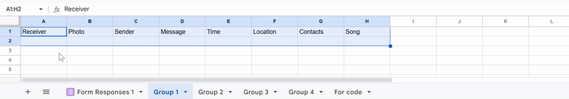
 
 
Note: if you are reordering the columns for your convenience (but still keeping the "Group song" questions last), you may adapt all the formulas to your self by changing both `G`-s in `'Form Responses 1'!$G$2:$G` to the letter of the "Time and Group" column as it is in `Forms Responses 1`, and changing the `6` in `=TRUE)),6,True)` to the numbered order of that same "Time and Group" column (if you are counting on `Forms Responses 1`, subtract 2 from the number you get).
 
 
<input type="checkbox"> 5. Copy everything from the box below (again, to not miss some part of the formula, you could just click inside the box, `Ctrl + A`, `Ctrl + C`) and paste it to the first cell of the `For code` sheet.
 
<textarea cols="143" rows="2" style="resize:none;">All slots	Occupied slots	Unique occupied slots		Total	Unique
	=IFERROR(FILTER('Form Responses 1'!G$2:G, REGEXMATCH('Form Responses 1'!$G$2:$G,".*Group.*") =TRUE))	=UNIQUE('Form Responses 1'!G2:G)		=COUNTA(B2:B)	=COUNTA(C2:C)
				=IF(E2=F2,"No duplicates","Duplicates! Find 'em!")	</textarea>
 
 
<input type="checkbox"> Choose the `E2` cell, go to `Format` -> `Conditional formatting`. Set it to turn green when `Text is exactly` is `No duplicates`, and to turn red when `Text is exactly` is `Duplicates!`.
 

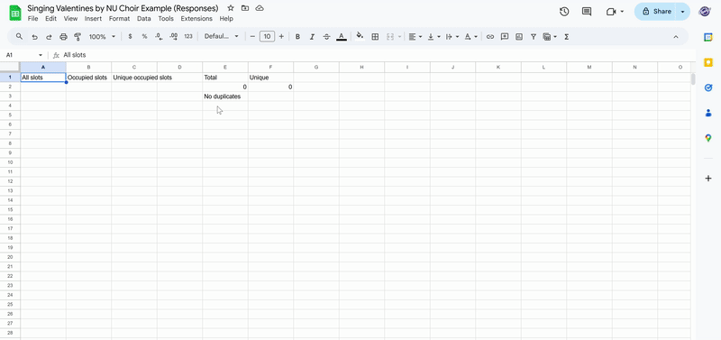
 
 
<input type="checkbox"> Choose the `B` column, go to `Format` -> `Conditional formatting`. Set the range to `B:B`, and set it to turn red when `Custom formula is` is `=countif(B:B,B1)>1`.
 
 
<input type="checkbox"> Choose the `E2` cell, go to `Tools` -> `Conditional notifications`, click on `Add rule`, change `In this column` to `Custom range`, click `Add condition`, set it to `Text is exactly` is `Duplicates!`, input the `choir@nu.edu.kz` email in the box at the bottom, and click on `Save`.
 

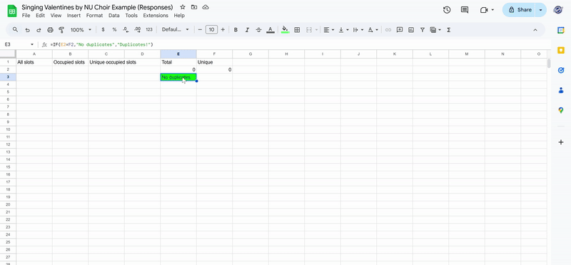
 
 
Quick manual check if the conditions work:
 

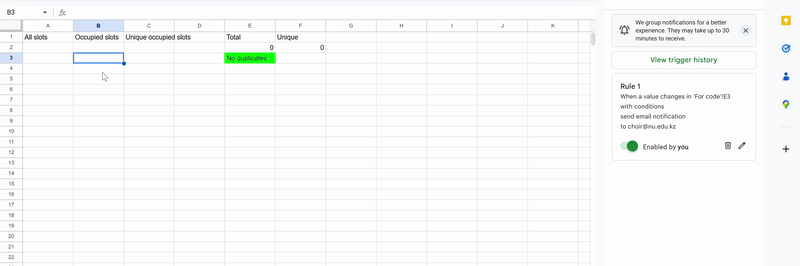
 
 
If there is EVER two or more people who book the exact same slot at the exact same time, there WILL be a duplicate. If that happens, you will get an email about it (within 30 minutes allegedly), or you can see it colored in red immediately on the `For code` sheet of this Google Sheet (you can scroll through the time slots and see which time slot is problematic, and notify the person who was slightly later that their order is canceled ASAP, or maybe perform for them all by cascading the time slightly for both xD however you decide to handle it).
 
 
<input type="checkbox"> 6. ggg
 
<label>Start Hour: <input type="number" id="start_h" min="0" max="23" value="9"></label>
 
<label>Start Minute: <input type="number" id="start_m" min="0" max="59" value="0"></label>
 
<label>End Hour: <input type="number" id="end_h" min="0" max="23" value="17"></label>
 
<label>End Minute: <input type="number" id="end_m" min="0" max="59" value="0"></label>
 
<label>Interval (minutes): <input type="number" id="interval" min="1" value="15"></label>
 
<label>Groups (comma-separated emojis): <input type="text" id="groups" value="🌟,💝,🌸,💘"></label>
 
<button onclick="generateSlots()">Generate Schedule</button>
 
<textarea id="output" cols="143" rows="10" style="resize:none;"></textarea>
 
There are 0 time slots total! This is important for later.
 

## **3. _(optional, but recommended)_ Create a Separate Google Sheet for the Members (for Respondent Privacy)**
ggg
 
 

## **4. Create and Set Up the Apps Script for the Google Sheets**
ggg
 
 

